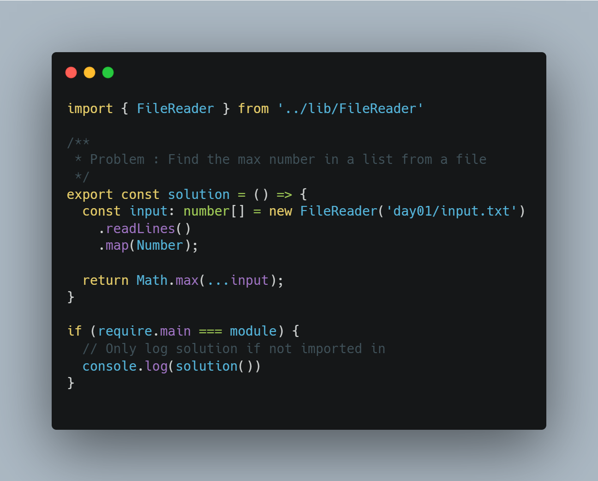

# Advent Of Code 2021
#### Author: Orville Daley (@crypto-cmd)
####
> Solution Set for 2021 Advent Of Code
### Technologies Used

## Why was this created?
This repo is to store my solutions to Advent Of Code 2021. It leverages VS Code Tasks, Bash and Python to automate building and running the solutions.

## Example and Instructions
 

1. Hit <kbd>Ctrl</kbd>+<kbd>Shift</kbd>+<kbd>P</kbd>
2. Enter `Tasks`
3. Tap `Tasks: Run Tasks` then press `Run AOC Script: Specific Day`
4. Type the specific day and hit <kbd>Enter</kbd>
5. View output in console.
